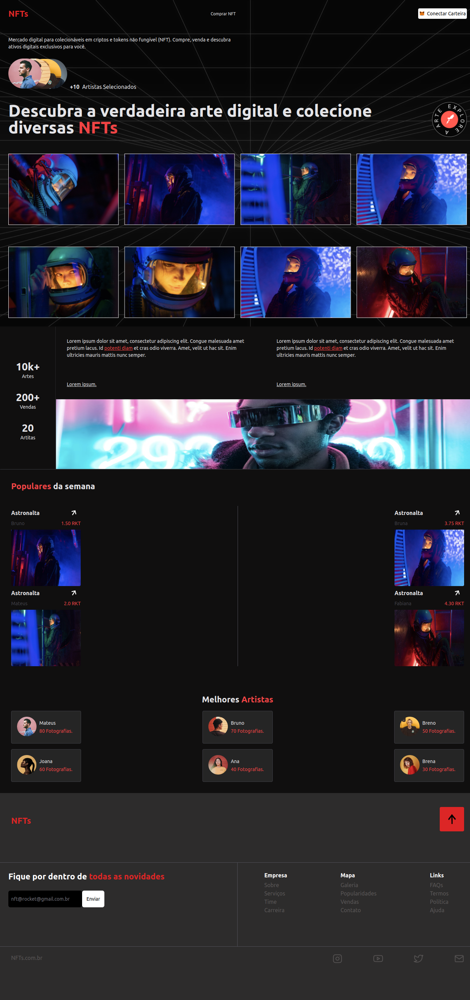

# NFTs;

## Começando.

Olá, nesse projeto foi desenvolvida uma landing page abordando o tema de NFTs.

### 📋 Pré-requisitos

Para você rodar o projeto em sua maquina local você necessita ter essa tecnologia já instalada ou você pode instalar:

- Yarn: você pode instalar o yarn ([clicando aqui](https://classic.yarnpkg.com/lang/en/docs/install/#debian-stable)).

## Executando o projeto em seu ambiente de desenvolvimento

Primerio você precisa instalar as depências com o comando:

```
yarn install
```

Em seguida execute o comando para inicializar o projeto:

```
yarn run dev
```

<br>
Após executar o comando yarn run dev, você pode acessar o site na sua porta local!
<br><br>

Uma demostração do site!
<br><br>


<br><br>

## 🛠️ Tecnologias utilizadas.

- [TypeScript](https://www.typescriptlang.org/) - É uma tecnologia desenvolvida pela microsoft, é um superSet do javaScript que permite utilizar tipagem estática facilitando a escrita do código.

- [React](https://pt-br.reactjs.org/) - É uma biblioteca de código aberto desenvolvida pelo facebook. Seu principal objetivo é o desenvolvimento de UI para web.

- [Tailwindcss](https://tailwindcss.com/) - É um framework que permite escrever CSS de um jeito diferente, a sua principal característica é fornecer classes utilitárias para podermos escrever CSS em nossos arquivos de marcação jsx, tsx, por exemplo.

- [Postcss](https://www.npmjs.com/package/postcss) - É uma ferramenta para transformar estilos com plug-ins CSS. Estamos utilizando o autoprefixer que é um dos plug-ins do postcss.

- [Vite](https://vitejs.dev/) - É uma ferramenta de contrução que pode ser utilizada com a maioria das estruturas web, como ReactJs, VueJs, entre outras. O vite é uma exelente ferranta que trás mais performace para o seu app. O vite foi criado pelo mesmo criado do vueJs, o evan you.

## ✒️ Autor

- [Mateus](https://github.com/mateusfelixdias).
